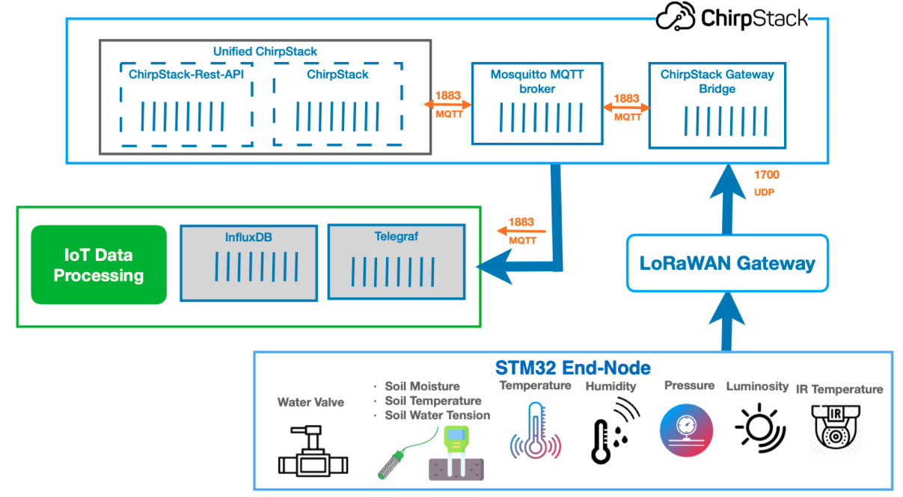

# Smart Water LoRaWAN-based Irrigation System
## Overview

This project presents an end-to-end smart irrigation system designed for water-efficient precision agriculture. It combines multi-parameter soil and weather sensing with autonomous actuator control, all coordinated over a low-power wide-area  LoRaWAN network. 
Sensor data is continuously uploaded to a cloud server where two key agronomic indicators are derived: the evapotranspiration (ET) — quantifying water loss from soil and vegetation through combined evaporation and plant transpiration — and the Crop Water Stress Index (CWSI), which assesses the degree of water stress experienced by the grass or canopy by comparing actual to potential transpiration.

## System Architecture



## Hardware

- [STM32WL55](hardware/endnode-stm32wl55jc.md): STM32 LoRa Board active and fully supported by STMicroelectronics. [https://www.st.com/en/microcontrollers-microprocessors/stm32wl55jc.html
](https://www.st.com/en/microcontrollers-microprocessors/stm32wl55jc.html).  
   - Sensors: 
     - [Watermark-200ss](hardware/sensors/watermark.md): measures soil water tension
     - [DFRobot-SEN0308](hardware/sensors/sen0308.md): measures soil _moisture_ (volumetric water content as a percentage) 
     - [DS18B20](hardware/sensors/ds18b20.md): measures soil temperature
     - [BME680](hardware/sensors/bme680.md): measures air temperature, relative humidity and barometric pressure
     - [SI1145](hardware/sensors/si1145.md): measures visible & NIR (Near Infra-Red) light and estimates a UV index using a mathematical approximation from visible and IR readings 
     - [AMG8833](hardware/sensors/amg8833.md) (8 x 8 Pixels): Thermal sensor to measure the spatial temperature distribution of the canopy/grass surface. Used to derive the Crop Water Stress Index (CWSI).
     - [AMG8833](hardware/sensors/amg883) (8 x 8 Pixels): Thermal sensor to measure the spatial temperature distribution of the canopy/grass surface. Used to derive the Crop Water Stress Index (CWSI).
   - Actuator: 5V relay module to control a solenoid valve for water flow management
- [Dragino-LPS8](hardware/gateway-dragino-lps8.md): An open source LoRaWAN Gateway. [https://www.dragino.com/products/lora-lorawan-gateway/item/148-lps8.html
](https://www.dragino.com/products/lora-lorawan-gateway/item/148-lps8.html)
## Repository structure

```
README.md                         
│
├── hardware/
│   ├── README.md
│   ├── stm32wl55jc.md
│   ├── lps8.md                  
│   ├── sensors/
│   │   ├── watermark.md      
│   │   ├── sen0308.md
│   │   ├── ds18b20.md
│   │   ├── bme680.md
│   │   ├── si1145.md
│   │   └── amg8833.md
│   └── actuator/
│       └── solenoid-valve.md      
├── firmware/
│   └── stm32wl55jc
│   ├── watermark200ss
│   ├── sen0308 
│   ├── ds18b20 
│   ├── bme680 
│   ├── si1145 
│   └── amg8833                  
│
├── network/
│   └── README.md                  
│
├── data-processing/
│   └── README.md                  
│
└── dashboard/
    └── README.md  
    
```              
